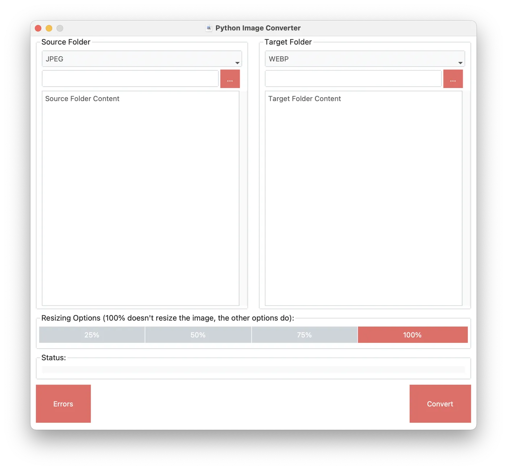

# Python Image Converter (pyimageconverter)
A simple Python console and GUI application for image conversion

In this version it can convert images between PNG,JPEG and WEBP formats.
The converted images can also be resized.

To use the GUI version, add -g to the command line.

## Default Values
```
-d '.'
-s JPEG
-t WEBP
```
## Basic Use / Examples

### Help
```
python3 main.py -h

usage: main.py [-h] [-d DIRECTORY] [-f FILE] [-s {JPEG,PNG,WEBP}] [-t {JPEG,PNG,WEBP}] [-r {25,50,75,100}] [-g]

options:
  -h, --help            show this help message and exit
  -d DIRECTORY, --directory DIRECTORY
                        Converts files in the folder defined, its the default option with local folder ".": -d <Folder Path>
  -f FILE, --file FILE  Converts the file defined: -f <File Path and Name>
  -s {JPEG,PNG,WEBP}, --source {JPEG,PNG,WEBP}
                        Source File Type: -s JPEG
  -t {JPEG,PNG,WEBP}, --target {JPEG,PNG,WEBP}
                        Target File Type: -s WEBP
  -r {25,50,75,100}, --resize {25,50,75,100}
                        Resizes Image to specified percentage
  -g, --gui             Enables GUI version
```

### Default (without any parameter)
This will convert any JPEG images to WEBP image in the current folder.
```
python3 main.py

Python Image Converter
https://github.com/demagomes/pyimageconverter
Progress: |██████████████████████████████████████████████████| 100.0% Complete
Errors:
```

### Convert all PNG files in a folder to JPEG 
```
python3 main.py -s JPEG -t PNG
```

### Convert a specif JPEG file to PNG
```
python3 main.py -f IMG_1802.jpeg -t PNG
```

### Resize all JPEG files to 25% of its original size and convert them to WEBP 
```
python main.py -r 25
```

### Resize a specif JPEG file to 25% of its original size Convert the file to PNG
```
python3 main.py -f IMG_1802.jpeg -t PNG -r 75
```


## GUI

The GUI version, does nearly everything that the console version does.
It uses tkinter and ttkbootstrap.



To run the script with the GUI:
```
python3 main.py -g
or
python3 main.py --gui
```


## External Libraries
- Pillow
- pytest
- ttkbootstrap

## Next Steps
- Work with more file formats available in the Pillow library
- Some basic file manipulation like size and resolution as well as image enhancements
- Refactor the GUI functions so some granular test can be added in the form of unittests

